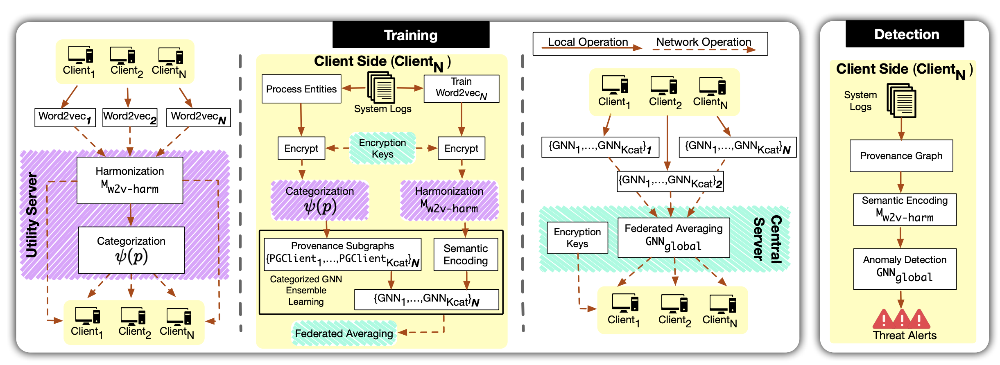

# Privacy-Preserving Intrusion Detection

Implementation of a privacy-aware machine learning system for intrusion detection. The goal is to detect security threats while preserving the privacy of sensitive data using techniques such as federated learning, differential privacy, and cryptographic approaches.

## What Makes This Project Stand Out
- Robust, end-to-end system: from raw data parsing to evaluation and reporting
- Privacy-by-design: integrates privacy-preserving techniques without sacrificing utility
- Modular and extensible: plug-and-play components for feature extraction and models
- Reproducible evaluations: deterministic pipelines with pre-trained weights
- Real-world datasets: evaluated across multiple DARPA datasets and scenarios

## Overview

This system implements approaches to intrusion detection that balance security effectiveness with privacy preservation. It analyzes system logs and network activity while minimizing exposure of sensitive information.

## Architecture



High-level architecture of the privacy-preserving intrusion detection system. In the training phase, the system builds local provenance graphs for each client and trains an ensemble of GNN models. Prior to this, Word2vec models are harmonized in a privacy-preserving manner using encryption and dual-server architecture for semantic encoding. The local GNN models participate in federated learning to develop a global model, which is then utilized for anomaly detection.

## Architecture Overview
- Data Ingestion & Parsing: dataset-specific parsers embedded in notebooks under `Evaluation_Scripts/`
- Feature Engineering:
  - Word embeddings for system events (e.g., cryptographic word2vec)
  - Graph-based representations (graph2vec) for structural patterns
- Model Layer:
  - Configurable pipelines for centralized or federated training
  - Support for differential privacy training regimes
- Evaluation & Reporting:
  - Standardized metrics and experiment tracking within notebooks
  - Pre-trained weights for quick benchmarking

## Prerequisites
To run this project, you need to install a Jupyter environment. More detailed instructions on installing and running Jupyter Notebooks can be found at this [Link](https://jupyter.org/install).

## Installation
We have provided a requirements.txt file detailing the specific dependency versions. Use the following command to install the required libraries.
```bash
pip install -r requirements.txt
```

## Quick Start
1. Launch Jupyter:
   ```bash
   jupyter lab
   ```
2. Open a notebook under `Evaluation_Scripts/` (e.g., `DARPA_E3.ipynb`, `DARPA_E5_CADETS.ipynb`).
3. Review the parameters section in the notebook to configure components.
4. Run all cells. The results are displayed at the end of the notebook.

## Configuration
- Each notebook exposes a parameters cell to configure:
  - Dataset paths and sampling settings
  - Choice of feature extractor (word2vec, graph2vec)
  - Model/training options (centralized vs federated, DP settings)
  - Evaluation metrics and output paths
- Weights: pre-trained models are provided under `Utils/weights/` for quick runs.

## Datasets
This project is evaluated on open-source datasets from DARPA and the research community. Access the datasets using the links below.

### DARPA OpTC
- **Source**: [OpTC Dataset](https://github.com/FiveDirections/OpTC-data)
- **Description**: Operational Technology Cybersecurity dataset for intrusion detection

### DARPA E3
- **Source**: [E3 Dataset](https://drive.google.com/drive/folders/1fOCY3ERsEmXmvDekG-LUUSjfWs6TRdp)
- **Description**: Enterprise Email Exfiltration dataset

### DARPA E5
- **Source**: [E5 Dataset](https://drive.google.com/drive/folders/1okt4AYElyBohW4XiOBqmsvjwXsnUjLVf)
- **Description**: Enterprise Email Exfiltration dataset with multiple scenarios

## Project Structure

### Evaluation Scripts
- **Location**: `Evaluation_Scripts/` directory
- **Purpose**: Contains dedicated Jupyter notebooks for each dataset evaluation
- **Features**: 
  - Integrated data parsers for each dataset
  - Automated downloading, parsing, and evaluation pipelines
  - Pre-trained model weights for immediate evaluation
  - Configurable parameters for different system components

### Ablation Studies
- **File**: `Ablation_Studies_Modules.ipynb`
- **Purpose**: Modular components for conducting ablation studies
- **Features**: Plug-and-play components that can be combined with base evaluation scripts

### Utilities
- **Location**: `Utils/` directory
- **Contents**: 
  - Cryptographic word2vec implementations
  - Graph2vec utilities
  - Privacy analysis tools
  - Pre-trained model weights and artifacts

### Example Layout
```text
Evaluation_Scripts/
  Ablation_Studies_Modules.ipynb
  DARPA_E3.ipynb
  DARPA_E5_CADETS.ipynb
  DARPA_E5_CLEARSCOPE.ipynb
  DARPA_E5_THEIA.ipynb
  DARPA_OPTC.ipynb
Utils/
  graph2vec.py
  cryptographic_word2vec.ipynb
  combine_word2vecs.ipynb
  privacy_analysis.ipynb
  artifacts/
  weights/
docker_setup.sh
requirements.txt
```

### Key Features
- **Privacy-Preserving ML**: Implements federated learning and differential privacy techniques
- **Multi-Dataset Support**: Evaluation across DARPA OpTC, E3, and E5 datasets
- **Modular Design**: Easy integration of different privacy-preserving components
- **Reproducible Results**: Pre-trained weights and standardized evaluation pipelines

## Tech Stack
- Python, Jupyter Notebooks
- PyTorch (models and training)
- Gensim (word2vec), NetworkX/graph utilities (graph2vec)
- Docker (optional environment setup via `docker_setup.sh`)

## Reproducibility & Results
- Deterministic seeds set within notebooks where applicable
- Pre-trained weights provided for quick validation
- Results sections at the end of each notebook summarize metrics per dataset

## Notes
- Datasets are large and hosted externally; see links above for access
- Some notebooks may require paths to be updated to your local dataset location


